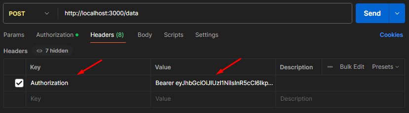

# **User Authentication API**

This project is a **User Authentication API** built with **Node.js**, **Express.js**, **MongoDB**, **Mongoose**, **bcrypt**, **jsonwebtoken**, and **dotenv**. It provides endpoints for user registration, login, and access to protected routes using JSON Web Tokens (JWT).

## **Features**

- User registration with hashed passwords.
- Secure login with JWT token generation.
- Middleware for protected routes to verify JWTs.
- Environment variable configuration using dotenv.

## **Technologies Used**

- **Node.js**: JavaScript runtime for server-side applications.
- **Express.js**: Web framework for building APIs.
- **MongoDB**: NoSQL database for storing user data.
- **Mongoose**: Object Data Modeling (ODM) library for MongoDB.
- **bcrypt**: Library for hashing passwords.
- **jsonwebtoken**: For creating and verifying JWTs.
- **dotenv**: For environment variable management.

## **Getting Started**

### **Prerequisites**

Ensure you have the following installed:

- [Node.js](https://nodejs.org) (v14 or above)
- [MongoDB](https://www.mongodb.com/try/download/community) (running locally or a connection URI)
- [Postman](https://www.postman.com/downloads)

### **Installation**

1. Clone the repository:
2. Install dependencies:

   ```bash
   npm install
   ```

3. Create a `.env` file in the root directory and add the following variables:

   ```plaintext
    PORT=3000
    MONGO_URI=mongodb://127.0.0.1:27017/auth_demo
    JWT_SECRET=mySuperSecretKey12345
    JWT_EXPIRES_IN=1h
    BCRYPT_SALT_ROUNDS=10
   ```

### **Run the Server**

```bash
node index.js
```

The API will run at `http://localhost:3000` (or the port specified in `.env`).

## **API Endpoints**

| Method | Endpoint       | Description         | Request Body                                                            | Authorization |
| ------ | -------------- | ------------------- | ----------------------------------------------------------------------- | ------------- |
| POST   | `/auth/signup` | Register a new user | `{ "name": "John", "email": "john@example.com", "password": "123456" }` | None          |
| POST   | `/auth/login`  | User login          | `{ "email": "john@example.com", "password": "123456" }`                 | None          |

On successful login, you will receive a JWT token.

**Access Protected Routes:** Include the JWT token in the `Authorization` header as follows:

   ```plaintext
   Authorization: Bearer <your-token>
   ```

    

## **Project Structure**

```bash
project/
├── .env # Environment variables
├── index.js # Main entry point
├── models/
│ └── userModel.js # User schema and model
├── routes/
│ └── authRoutes.js # Authentication routes
├── package.json # Dependencies and scripts
└── README.md # Project documentation

```

## **📄 License**

This project is licensed under the MIT License - see the [LICENSE](LICENSE) file for details.

## **🤝 Contributing**

Pull requests are welcome. For major changes, please open an issue first to discuss what you would like to change.
